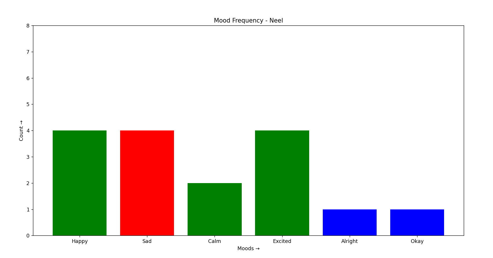
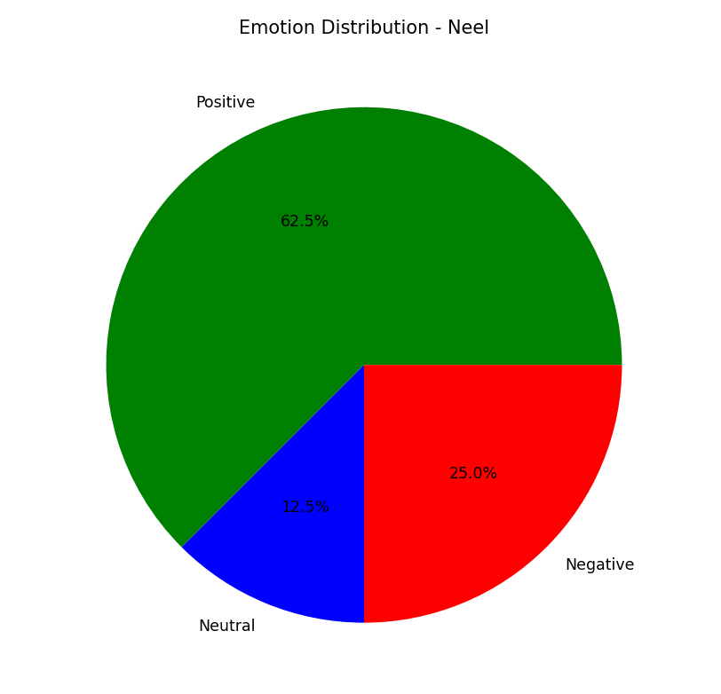

# Mood Logger

A Python project that evolved from a simple mood tracker into a complete emotional analytics dashboard.

## Features

- Mood tracking
- Mood history
- JSON data storage
- Mood streak detection
- Emotional scoring system
- Timestamp tracking
- User insights
- Dashboard statistics
- Bar chart visualization
- Pie chart visualization

## Technologies Used

- Python
- JSON
- Matplotlib

## Project Evolution

### V1
Basic mood tracker

### V2-V5
Improved responses and mood handling

### V6
JSON data storage

### V7
Mood streak analysis

### V8
Emotional scoring and insights

### V9
Timestamp tracking

### V10
Dashboard and graphical analytics

## Bar Chart

## Pie Chart

## Future Improvements

- CSV export
- Multiple dashboards
- GUI version using Tkinter
- Web version using Flask
